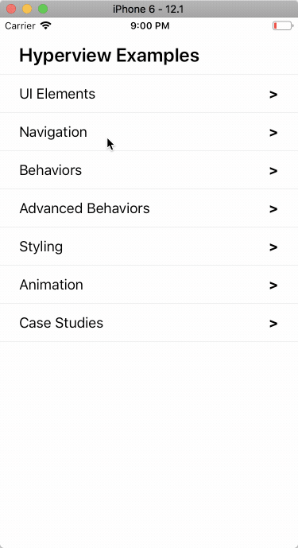

[](https://hyperview.org)

# Native mobile apps, as easy as creating a website.

[Hyperview](https://hyperview.org) is a new hypermedia format and React Native client for developing server-driven mobile apps.

- **Serve your app as XML**: On the web, pages are rendered in a browser by fetching HTML content from a server. With Hyperview, screens are rendered in your mobile app by fetching Hyperview XML (HXML) content from a server. HXML's design reflects the UI and interaction patterns of today's mobile interfaces.
- **Work with any backend web technology**: Use battle-tested web technologies like Django, Rails, or Node. Any HTTP server can host a Hyperview app. You can even deploy your app as a collection of static XML files if you want!
- **Update your apps instantly by deploying your backend**: Say goodbye to slow release cycles and long app store review times. With Hyperview, your backend controls your app's layout, content, and available actions. This means you can update any aspect of your app with a server-side change. True CI/CD is finally attainable for mobile development.
- **Forget about API versioning and backwards compatibility**: Unlike traditional native apps, every user always runs the most recent version of your code. With no version fragmentation, you can be more productive by eliminating the need to support and maintain older app versions.

See the [Hyperview website](https://hyperview.org) for more information about Hyperview and Hyperview XML.

## Hyperview XML

- See examples of how to create rich, interactive apps with Hyperview XML [here](https://hyperview.org/docs/example_navigation)
- See the full references for Hyperview XML [here](https://hyperview.org/docs/reference_screen)

## Hyperview React Native Client

[](https://circleci.com/gh/Instawork/hyperview)

This repo contains a React Native implementation of the Hyperview Client. It can either be integrated into an existing React Native app, or used to create a self-contained RN app.

### Requirements

The Hyperview client only has the following required dependencies:

- @instawork/xmldom = 0.0.3
- lodash = 4.17.21
- tiny-emitter = 2.1.0
- url-parse = 1.5.10

More importantly, the client is designed to be incorporated into an existing React Native project, and thus has the following peer dependencies:

- @react-native-community/datetimepicker >= 7.6.2
- @react-native-picker/picker >= 2.6.1
- @react-navigation/bottom-tabs >= 6.5.7
- @react-navigation/native >= 6.1.6
- @react-navigation/stack >= 6.3.16
- @types/react >= 17.0.67
- react >= 17.0.2
- react-native >= 0.67.4
- react-native-gesture-handler >= 2.11.0
- react-native-safe-area-context >= 4.2.4
- react-native-webview >= 13.2.2

### Getting Started

This repo contains an example XML server that serves Hyperview XML to showcase the available features.
It also contains a demo Expo project that can connect to the example XML server, or any other Hyperview endpoint.

#### 1. Install dependencies

From the `demo/` directory:

```sh
yarn
```

Note: you only need to run this step once.

#### 2. Run the demo server

From the `demo/` directory:

```sh
yarn server
```

This will start an HTTP server listening on port 8085.

The next step depends on whether you want to run the demo app in the iOS simulator, on an Android Virtual Device, or on a physical mobile device.

##### Running on the iOS simulator

From the `demo/` directory:

```sh
yarn ios
```

This will open the iOS simulator and install the demo app in the simulator. It will then start the Expo development server to load the demo app.

##### Running on an Android Virtual Device

From the `demo/` directory:

```sh
adb reverse tcp:8085 tcp:8085
yarn android
```

This will open an AVD and install the demo app in the emulator. It will then start the Expo development server to load the demo app.

##### Running on a physical device

On your physical mobile device, install the Expo client

- [iOS App Store](https://itunes.apple.com/us/app/expo-client/id982107779?mt=8)
- [Google Play Store](https://play.google.com/store/apps/details?id=host.exp.exponent)

Make sure your mobile device and development machine are connected to the same network.

From the `demo/` directory on your development machine (replace X.X.X.X with the IP of your machine. This is needed in order for your physical device to be able to request the example XML files from your development machine.)

```sh
cd demo
BASE_URL="http://X.X.X.X:8085" yarn start
```

This command will start an Expo development server and will display a QR code.

- On your iOS device, open the Camera app and point it at the QR code on your screen. The Camera app should show an "Open in Expo" notification. Tap this notification.
- On your Android device, use the Expo app to scan the QR code on your screen.

#### Developing hyperview core features

As you're developing new features for hyperview core, you can use the demo app along with this special command to help you quickly test your changes:

```sh
yarn sync
```

This command will update the installed hyperview package to use the untransformed code (so that it can easily be debugged), watch any changes made to `src/` and copy them into `demo/node_modules/hyperview/src`.

You can also pass as an additional argument the root path of your own react-native app where you've installed hyperview to perform the same sync/watch operation. e.g.

```sh
yarn sync ../projects/my-cool-app
```

> **Tip**
>
> You may stop this with <kbd>Ctrl</kbd> + <kbd>C</kbd>

#### 3. You're all set!

Whether you're using a physical device or simulator, you should now see a Hyperview screen rendered from the example server:



The example server simply serves files from the [./examples](/examples) directory. You can modify or add files in [./examples](/examples) and the server will update without restarting.

#### Running storybook

1. Run the following to generate storybook. You would need the `application_key` which is the `string` passed as a first argument to the method `AppRegistry.registerComponent` in your root react-native component:

```bash
yarn generate <application_key>
```

2. Start the storybook by running following in repo root:

```bash
yarn storybook
```

3. Now you may open [http://localhost:7007](http://localhost:7007) on your browser to view storybook controls.

4. Start the app registered as `application_key`.

> **Note**
>
> If you're getting issues about duplicate modules try removing the `node_modules` from `/demo` and retry.

#### Troubleshooting

> This version of the Expo app is out of date. Uninstall the app and run again to upgrade.

If you see this warning message on the Expo development server webpage, you need to uninstall the Expo app from the simulator or physical device and install the latest version. On a physical device, this means getting the latest version from an app store. In the simulator or AVD, this means uninstalling and re-running `yarn ios` or `yarn android`.
